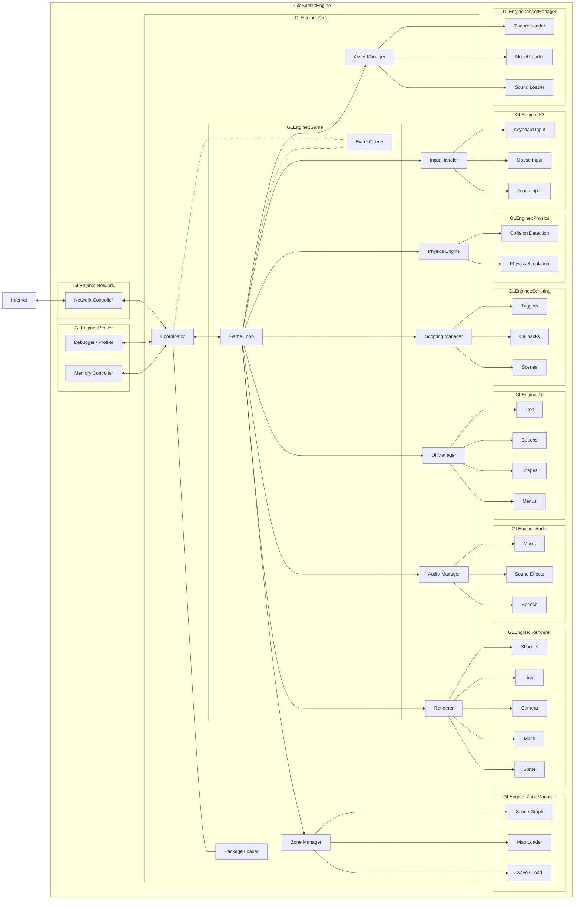

# Pixospritz - Architecture & Engine Specification

The PixoSpritz engine is designed to be a both a playground, game engine, and storytelling device. It is built around the idea of declarative game design, and package-based adventures over a shared protocol stack. The end result is to allow for a universal packaging system which can be adopted across various architectures and platforms to provide interoperability.

In addition to cross-platform operation, the design helps facility cross-publisher, and multi-game integration where players can merge unique standalone titles into larger more immersive experiences. Allowing players to take a character from one world into the next and continue their story.

PixoSpritz envisions a kind of cooperative and multiplayer expierience unlike anything else. Rather than just have an MMO, or having users craft custom games within an online environment - the goal is to allow players to choose their paths and for the standard to allow for their interoperation.

Learn a spell in a fantasy world, then roam the streets of New York and freeze taxis in the streets! This is the dream of PixoSpritz.

## Architecture

The overall architecture is split into two areas of application:

- PixoSpritz Engine: The engine is what instructs everything, and is the central client. The engine presently is built up around JavaScript and WebGL, but in theory there is no limit to what language or architecture it is built around, provided it can parse and interpret the package contents, the engine should be standalone. In the future, the goal is to provide a built-in editor which can be enabled and used to develop a game directly using the engine itself. This editor would be an extra optional component and would not be a requirement of the PixoSpritz standard. Rathert the standard specification would define merely the expected behaviour for the core engine modules themselves, and implementers would be free to adjust their implementation on the editor or skip it entirely.

- PixoSpritz Package: The package is the where the unique game content lives and where all assets are stored. These packages are designed to be both standalone as well as dynamically interoperable. By having the ability to link up packages there is the ability to create one large ongoing experience or to provide an episodic one. These episodes could be standalone or even allow users to resume their progress as new ones become available.

### Engine Architecture

### Package Based Design

There are many future ideas regarding the flexibility of serving the content, and since it is package-based game design - the content can be hashed, and distributed via a variety of means including direct download, upload, torrent, IPFS, and more. This allows for a very flexible platform to design unique experiences that are not locked down such as traditional games are.

### Networked Multiplayer

By establishing a network layer directly within the engine architecture (albeit as an optional element and not necessary for standalone play) the system provides for a flexibility that is seldom found within games. The capacity to interconnect maps and games from people who have never met is a new feature that has not really be done to any major effect.

## Future Applications

The following is an inexhaustive list of things to look into and explore for future applications:

- Offline + Online Support / Drop-out / Latency Support
- IPFS content Serving
- Signed Packages / DRM
- Episode Support / Series
- RSS / Subscription to New Episodes
- Hub Worlds / Directory Zones
- Trophy System / Quest Tracker --> Which leads to
- Distributed Shared State Network Protocol --> A distributed network protocol layer to handle shared world states for "Real-time" multiplayer experiences with a single world state.
