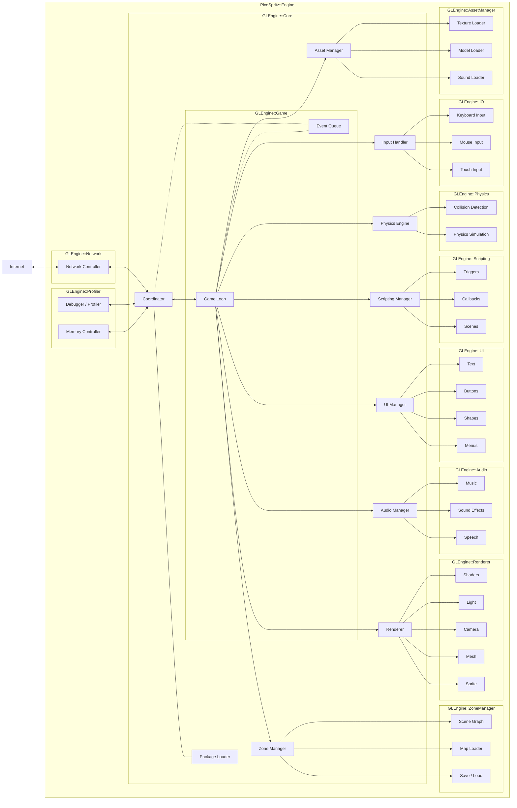

# Pixospritz - Architecture & Engine Specification

## Overview
The Pixospritz engine is a modular, declarative game engine and storytelling platform. It supports cross-platform, cross-publisher, and multi-game integration, allowing players to merge standalone titles into larger, persistent experiences. The engine is built in JavaScript/WebGL, but is designed for portability and extensibility.

## Key Features
- **Package-based design:** Game content is distributed in packages, supporting standalone and episodic play, and dynamic interoperability between packages.
- **Universal protocol:** Standardized data formats and APIs for assets, scenes, actions, and scripting.
- **Runtime extensibility:** Features like skybox shader switching, Lua scripting, and zone/manifest configuration can be changed at runtime.
- **Rendering pipeline:** Modern WebGL pipeline with support for custom shaders, skyboxes, tiles, 3D models, sprites, and transitions. Skybox shaders can be switched programmatically, via Lua, or by zone/manifest config.
- **Scripting:** Lua API exposes engine features, including skybox shader switching (`engine:set_skybox_shader("shaderName")`), zone management, and more.
- **Zone/manifest extensibility:** Zones and game manifests can specify rendering, audio, and gameplay configuration, including skybox shaders and other effects.
- **Editor integration:** Optional built-in editor for game development and debugging.
- **Networked multiplayer:** Optional network layer for shared world states and real-time multiplayer.

The overall architecture is split into two areas of application:

- PixoSpritz Engine: The engine is what instructs everything, and is the central client. The engine presently is built up around JavaScript and WebGL, but in theory there is no limit to what language or architecture it is built around, provided it can parse and interpret the package contents, the engine should be standalone. In the future, the goal is to provide a built-in editor which can be enabled and used to develop a game directly using the engine itself. This editor would be an extra optional component and would not be a requirement of the PixoSpritz standard. Rathert the standard specification would define merely the expected behaviour for the core engine modules themselves, and implementers would be free to adjust their implementation on the editor or skip it entirely.

- PixoSpritz Package: The package is the where the unique game content lives and where all assets are stored. These packages are designed to be both standalone as well as dynamically interoperable. By having the ability to link up packages there is the ability to create one large ongoing experience or to provide an episodic one. These episodes could be standalone or even allow users to resume their progress as new ones become available.

### Engine Architecture

```mermaid
graph LR
    WWW[Internet] <--> NC[Network Controller]
    subgraph "PixoSpritz::Engine"
        subgraph "GLEngine::Core"
            SP[Coordinator] <--> GM
            SP --- P[Package Loader] 
            SP -.- Q[Event Queue] 
            subgraph "GLEngine::Game"
                GM -..- Q
            end
        GM[Game Loop] --> ZN[Zone Manager]
        GM ----> RD[Renderer]
        GM ----> PH[Physics Engine]
        GM ----> IO[Input Handler]
        GM ---> AM[Asset Manager]
        GM ----> SR[Scripting Manager]
        GM ----> UI[UI Manager]
        GM ----> AU[Audio Manager]
        end
        subgraph "GLEngine::Network"
            NC <--> SP
        end
        subgraph "GLEngine::Profiler"
            DB[Debugger / Profiler] <--> SP
            MC[Memory Controller] <--> SP
        end
        subgraph "GLEngine::ZoneManager"
            ZN ----> SC[Scene Graph]
            ZN --> ML[Map Loader]
            ZN --> SL[Save / Load]
        end
        subgraph "GLEngine::Renderer"
            RD --> S[Shaders]
            RD --> F[Light]
            RD --> G[Camera]
            RD --> H[Mesh]
            RD --> V[Sprite]
        end
        subgraph "GLEngine::Audio"
            AU --> MU[Music]
            AU --> SF[Sound Effects]
            AU --> SH[Speech]
        end
        subgraph "GLEngine::UI"
            UI --> Tx[Text]
            UI --> Bt[Buttons]
            UI --> Sh[Shapes]
            UI --> Mn[Menus]
        end
        subgraph "GLEngine::Scripting"
            SR --> Tr[Triggers]
            SR --> Ca[Callbacks]
            SR --> Sc[Scenes]
        end
        subgraph "GLEngine::Physics"
            PH --> I[Collision Detection]
            PH --> J[Physics Simulation]
        end
        subgraph "GLEngine::IO"
            IO --> K[Keyboard Input]
            IO --> L[Mouse Input]
            IO --> T[Touch Input]
        end
        subgraph "GLEngine::AssetManager"
            AM ---> M[Texture Loader]
            AM --> N[Model Loader]
            AM --> O[Sound Loader]
        end


    end

```

## Rendering Pipeline
- **SkyboxManager:** Supports multiple shader effects (cosmic, sunset, morning, etc.), runtime switching via API, Lua, or zone/manifest config.
- **Tiles/Objects/Sprites:** Rendered in correct order with depth buffer management. Sprites, animated sprites, tiles, and 3D objects are all supported.
- **Transitions:** Customizable transition effects between scenes/zones.

### Package Based Design

There are many future ideas regarding the flexibility of serving the content, and since it is package-based game design - the content can be hashed, and distributed via a variety of means including direct download, upload, torrent, IPFS, and more. This allows for a very flexible platform to design unique experiences that are not locked down such as traditional games are.

### Networked Multiplayer

By establishing a network layer directly within the engine architecture (albeit as an optional element and not necessary for standalone play) the system provides for a flexibility that is seldom found within games. The capacity to interconnect maps and games from people who have never met is a new feature that has not really be done to any major effect.

## Future Applications

The following is an inexhaustive list of things to look into and explore for future applications:

- Offline + Online Support / Drop-out / Latency Support
- IPFS content Serving
- Signed Packages / DRM
- Episode Support / Series
- RSS / Subscription to New Episodes
- Hub Worlds / Directory Zones
- Trophy System / Quest Tracker --> Which leads to
- Distributed Shared State Network Protocol --> A distributed network protocol layer to handle shared world states for "Real-time" multiplayer experiences with a single world state.
